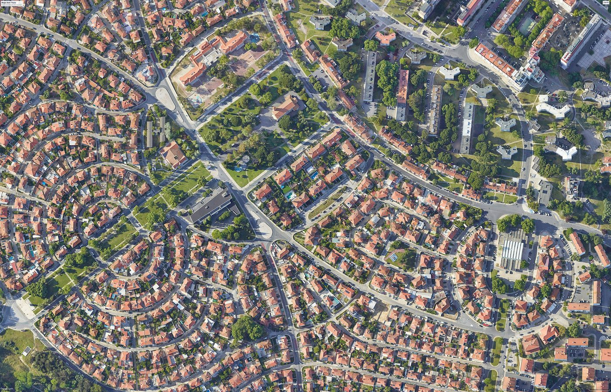

# EarthCapture


Automated extraction of satellite imagery from Google Earth Pro, plus small QGIS helpers for loading Google base layers.

## Example Capture



## What This Repo Contains

- `src/geo_earth_pro/` for the Google Earth Pro automation workflow
- `src/qgis/` for QGIS layer helpers
- `src/utils/` for geospatial grid calculations
- `examples/extract_images.py` as a usable CLI example
- `data/sample_coordinates.csv` as a sample batch input file
- `docs/` for installation, configuration, and API notes

## Prerequisites

- Python 3.8+
- Google Earth Pro installed and running
- A desktop session where `pyautogui` can control the mouse and keyboard
- Windows is the primary tested environment for the Google Earth Pro automation flow

QGIS is optional and only needed if you want to use the helper functions in `src/qgis/google_map.py`.

## Installation

```bash
python -m venv .venv
source .venv/bin/activate  # Windows: .venv\Scripts\activate
pip install -r requirements.txt
```

## Quick Start

Single coordinate:

```bash
python examples/extract_images.py --coordinate "38.7301, -9.1890"
```

Batch from the bundled sample CSV:

```bash
python examples/extract_images.py --csv data/sample_coordinates.csv --limit 2
```

Programmatic use:

```python
from src.geo_earth_pro.gep import ImageSet

image_set = ImageSet("38.7301, -9.1890")
image_set.start_downloading()
```

## Configuration

The automation depends on UI coordinates defined in `src/geo_earth_pro/config.py`.

Important settings:

- `UI_GEP`: normalized coordinates for Google Earth Pro buttons
- `IMAGES_FOLDER`: output directory for saved imagery
- `HISTORY_STEPS`: how many historical steps to capture
- `PAUSE_BETWEEN_ACTIONS`: delay between UI actions

If your screen layout differs from the original setup, recalibrate the coordinates before running large jobs.

## Repository Layout

```text
EarthCapture/
├── data/
│   └── sample_coordinates.csv
├── docs/
│   ├── API.md
│   ├── CONFIGURATION.md
│   ├── INSTALLATION.md
│   └── images/
│       └── extraction-sample.jpg
├── examples/
│   └── extract_images.py
├── src/
│   ├── geo_earth_pro/
│   │   ├── config.py
│   │   └── gep.py
│   ├── qgis/
│   │   └── google_map.py
│   └── utils/
│       └── calculation.py
├── requirements.txt
└── README.md
```

## Notes

- The Google Earth Pro workflow is UI automation, not an official API integration.
- Headless servers are not a good fit for the extraction flow because `pyautogui` needs an active desktop.
- The QGIS helper module is separate from the Google Earth Pro automation path.

## Contributing

Contribution guidelines are in [CONTRIBUTING.md](CONTRIBUTING.md).

## Citation

Citation metadata is available in [CITATION.cff](CITATION.cff).

## License

MIT. See [LICENSE](LICENSE).
